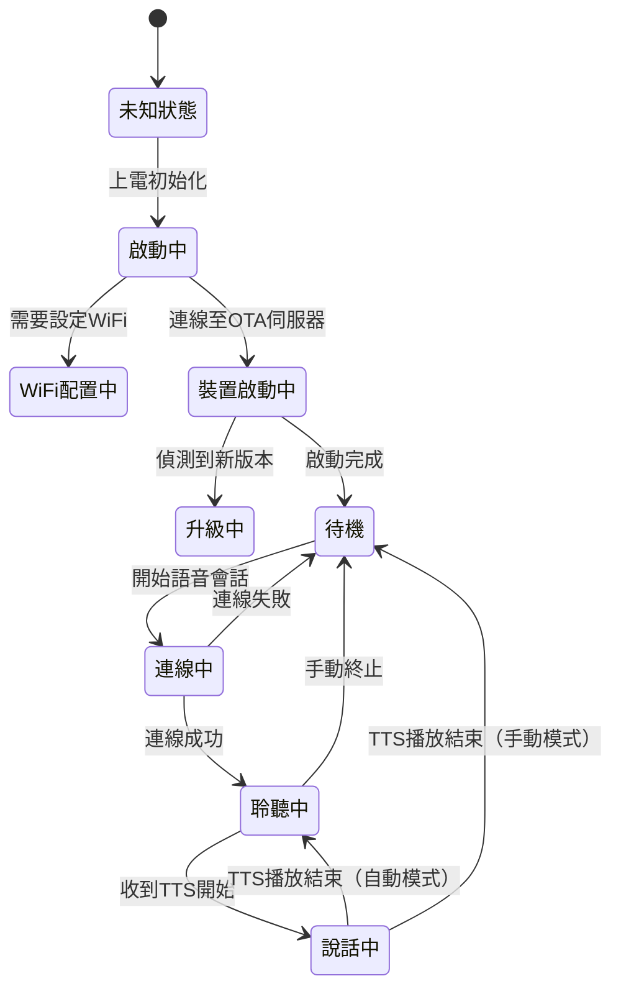

# 小智 ESP32 在線語音服務產品規格書

> **版本**：v2.x  
> **適用硬體**：ESP32-C3 / ESP32-S3 / ESP32-P4 / ESP32-C5 / ESP32-C6  
> **預設服務端**：[xiaozhi.me](https://xiaozhi.me)  
> **授權條款**：MIT（可免費商用）

---

## 目錄

1. [專案概述](#1-專案概述)
2. [在線語音服務總覽](#2-在線語音服務總覽)
3. [語音服務架構](#3-語音服務架構)
4. [核心在線語音服務](#4-核心在線語音服務)
   - 4.1 [自動語音辨識（ASR）](#41-自動語音辨識asr)
   - 4.2 [大型語言模型（LLM）](#42-大型語言模型llm)
   - 4.3 [語音合成（TTS）](#43-語音合成tts)
5. [通訊協議規格](#5-通訊協議規格)
   - 5.1 [WebSocket 協議](#51-websocket-協議)
   - 5.2 [MQTT + UDP 混合協議](#52-mqtt--udp-混合協議)
   - 5.3 [協議比較](#53-協議比較)
6. [音訊技術規格](#6-音訊技術規格)
7. [離線喚醒詞服務](#7-離線喚醒詞服務)
8. [MCP IoT 控制服務](#8-mcp-iot-控制服務)
9. [OTA 韌體更新服務](#9-ota-韌體更新服務)
10. [網路連線方式](#10-網路連線方式)
11. [支援語言](#11-支援語言)
12. [支援硬體平台](#12-支援硬體平台)
13. [安全性規格](#13-安全性規格)
14. [伺服器整合指南](#14-伺服器整合指南)
15. [技術參數速查表](#15-技術參數速查表)

---

## 1. 專案概述

**小智 AI 聊天機器人（XiaoZhi ESP32）** 是一款基於 ESP32 系列微控制器的開源 AI 語音互動裝置。透過雲端語音服務，使用者可以與裝置進行自然語言對話，並藉由 MCP（Model Context Protocol）協議對智慧家電、電腦桌面等設備進行語音控制。

### 核心特色

| 特色 | 說明 |
|------|------|
| 🎙️ 串流語音對話 | ASR + LLM + TTS 全鏈路串流，低延遲回應 |
| 🔔 離線喚醒詞 | 基於 ESP-SR 的本地喚醒，無需持續上傳音訊 |
| 🌐 雙協議支援 | WebSocket（簡單部署）及 MQTT+UDP（高效能）二選一 |
| 🤖 MCP IoT 控制 | JSON-RPC 2.0 標準，雙向 IoT 工具呼叫 |
| 🗣️ 多語言支援 | 支援 18+ 種語言，含繁體中文、簡體中文、英語、日語等 |
| 🔒 安全傳輸 | TLS/SSL for WebSocket，AES-CTR + TLS for MQTT+UDP |
| 📡 無線更新 | OTA 韌體自動更新，配置從雲端動態下發 |
| 🔊 聲紋辨識 | 支援 3D Speaker 說話人辨識 |

---

## 2. 在線語音服務總覽

當裝置連線至網際網路後，可獲得以下完整的在線語音服務：

```
┌─────────────────────────────────────────────────────────────────┐
│                    在線語音服務全景圖                              │
│                                                                   │
│  ┌──────────┐    ┌──────────┐    ┌──────────┐    ┌──────────┐  │
│  │  喚醒詞   │    │   ASR    │    │   LLM    │    │   TTS    │  │
│  │  偵測服務 │───▶│ 語音辨識  │───▶│ 語言模型  │───▶│ 語音合成  │  │
│  │(離線+在線)│    │  (雲端)  │    │  (雲端)  │    │  (雲端)  │  │
│  └──────────┘    └──────────┘    └──────────┘    └──────────┘  │
│                                                                   │
│  ┌──────────────────────────────────────────────────────────┐   │
│  │                    MCP IoT 控制服務                        │   │
│  │   設備端工具(音量/LED/相機) ◄──JSON-RPC──► 雲端工具(智慧家電) │   │
│  └──────────────────────────────────────────────────────────┘   │
│                                                                   │
│  ┌──────────────────────────────────────────────────────────┐   │
│  │               OTA 韌體更新 & 設備啟動服務                   │   │
│  └──────────────────────────────────────────────────────────┘   │
└─────────────────────────────────────────────────────────────────┘
```

---

## 3. 語音服務架構

### 3.1 音訊上行鏈路（麥克風 → 伺服器）

```
麥克風輸入
    │ (I2S 介面)
    ▼
[AudioCodec] 硬體抽象層
    │ (原始 PCM，可變取樣率)
    ▼
[AudioInputTask]
    ├──▶ [喚醒詞偵測引擎] (本地推理)
    └──▶ [AudioProcessor] 音訊前處理
         │ (AEC 回音消除 + 降噪 + VAD 語音活動偵測)
         ▼
    [Opus 編碼器] (16kHz, 單聲道, 60ms 幀)
         │ (Opus 壓縮封包)
         ▼
    [通訊協議層] WebSocket 或 MQTT+UDP
         │
         ▼
    [雲端伺服器] → ASR → LLM
```

### 3.2 音訊下行鏈路（伺服器 → 喇叭）

```
[雲端伺服器] LLM → TTS
    │
    ▼
[通訊協議層] WebSocket 或 UDP
    │ (Opus 壓縮封包)
    ▼
[Opus 解碼器] (24kHz, 單聲道, 60ms 幀)
    │ (PCM，依需求重新取樣)
    ▼
[AudioOutputTask]
    │ (I2S 介面)
    ▼
喇叭輸出
```

### 3.3 狀態機

裝置在整個語音互動過程中的狀態流轉：



---

## 4. 核心在線語音服務

### 4.1 自動語音辨識（ASR）

裝置將麥克風採集到的語音，以 **Opus 格式串流**上傳至雲端伺服器，由伺服器負責語音辨識。

#### 服務流程

1. 使用者喚醒裝置（喚醒詞或按鈕）
2. 裝置以 **16kHz Opus** 串流上傳語音
3. 伺服器即時進行語音辨識
4. 伺服器回傳 STT 識別結果（JSON 訊息）
5. 識別文字顯示於裝置螢幕

#### ASR 觸發訊號（裝置 → 伺服器）

```json
{
  "session_id": "xxx",
  "type": "listen",
  "state": "start",
  "mode": "auto"
}
```

#### STT 結果回傳（伺服器 → 裝置）

```json
{
  "session_id": "xxx",
  "type": "stt",
  "text": "今天天氣怎麼樣？"
}
```

#### 聆聽模式

| 模式 | 說明 | 適用場景 |
|------|------|---------|
| `auto` | 自動停止（偵測句尾靜音） | 一般對話 |
| `manual` | 手動停止（使用者鬆開按鈕） | 長篇口述 |
| `realtime` | 持續即時辨識（需 AEC 支援） | 即時翻譯/字幕 |

---

### 4.2 大型語言模型（LLM）

伺服器將 ASR 識別文字送入 LLM，生成回應，並透過 LLM 訊息通知裝置更新情感 UI。

#### LLM 情感訊號（伺服器 → 裝置）

```json
{
  "session_id": "xxx",
  "type": "llm",
  "emotion": "happy",
  "text": "😀"
}
```

#### 支援情感類型

裝置螢幕根據 `emotion` 欄位顯示對應的表情動畫，支援的情感值由伺服器實作定義（常見值：`happy`、`sad`、`angry`、`surprised`、`neutral` 等）。

#### 相容 LLM 服務

| LLM 服務 | 說明 |
|---------|------|
| Alibaba Qwen（通義千問） | 官方預設，中文優化 |
| DeepSeek | 高性價比推理模型 |
| 其他 OpenAI 相容 API | 伺服器端可自行配置 |

> **注意**：LLM 的選擇由**伺服器端**決定，裝置端無需修改韌體即可切換模型。

---

### 4.3 語音合成（TTS）

伺服器將 LLM 生成的文字轉換為語音，以 **Opus 格式串流**傳送至裝置播放。

#### TTS 控制訊號（伺服器 → 裝置）

| 訊號 | JSON 結構 | 說明 |
|------|-----------|------|
| 開始播放 | `{"type":"tts","state":"start"}` | 伺服器開始傳送音訊 |
| 句子字幕 | `{"type":"tts","state":"sentence_start","text":"..."}` | 當前播放的文字，顯示於螢幕 |
| 結束播放 | `{"type":"tts","state":"stop"}` | 本輪 TTS 播放完畢 |

#### TTS 中斷（裝置 → 伺服器）

當使用者再次觸發喚醒詞時，裝置發送中斷訊號：

```json
{
  "session_id": "xxx",
  "type": "abort",
  "reason": "wake_word_detected"
}
```

#### 音訊規格

| 參數 | 規格 |
|------|------|
| 編碼格式 | Opus |
| 取樣率 | 24000 Hz（伺服器下行，可協商） |
| 聲道 | 單聲道（Mono） |
| 幀時長 | 60 ms |

---

## 5. 通訊協議規格

裝置支援兩種與伺服器通訊的協議，可依部署環境選擇：

### 5.1 WebSocket 協議

#### 適用場景
- 開發測試、快速部署
- 無需穿透 UDP 防火牆的環境
- 簡化伺服器架構

#### 連線建立

裝置以以下 HTTP 標頭建立 WebSocket 連線：

| 標頭 | 說明 |
|------|------|
| `Authorization` | `Bearer <token>` 存取令牌 |
| `Protocol-Version` | 二進位協議版本（1, 2, 或 3） |
| `Device-Id` | 裝置 MAC 位址 |
| `Client-Id` | 軟體生成的 UUID |

#### 握手訊息

**裝置 → 伺服器（Hello）**
```json
{
  "type": "hello",
  "version": 1,
  "features": {
    "mcp": true
  },
  "transport": "websocket",
  "audio_params": {
    "format": "opus",
    "sample_rate": 16000,
    "channels": 1,
    "frame_duration": 60
  }
}
```

**伺服器 → 裝置（Hello 回應）**
```json
{
  "type": "hello",
  "transport": "websocket",
  "session_id": "xxx",
  "audio_params": {
    "format": "opus",
    "sample_rate": 24000,
    "channels": 1,
    "frame_duration": 60
  }
}
```

#### 二進位協議版本

| 版本 | 結構說明 | 適用場景 |
|------|---------|---------|
| **版本 1** | 直接傳送 Opus 原始資料 | 一般使用（預設） |
| **版本 2** | `[版本:2B][類型:2B][保留:4B][時間戳:4B][負載長:4B][負載]` | 伺服器端 AEC（回音消除） |
| **版本 3** | `[類型:1B][保留:1B][負載長:2B][負載]` | 簡化結構 |

#### JSON 訊息類型彙整

**裝置 → 伺服器**

| type | 說明 |
|------|------|
| `hello` | 連線握手，傳送音訊參數與功能清單 |
| `listen` | 開始/停止/偵測語音監聽 |
| `abort` | 中斷當前 TTS 播放 |
| `mcp` | MCP IoT 控制回應（JSON-RPC 2.0） |

**伺服器 → 裝置**

| type | 說明 |
|------|------|
| `hello` | 握手確認，傳送 session_id 及音訊參數 |
| `stt` | 語音辨識文字結果 |
| `llm` | 情感/UI 更新指令 |
| `tts` | TTS 播放控制（start/stop/sentence_start） |
| `mcp` | MCP IoT 控制指令（JSON-RPC 2.0） |
| `system` | 系統控制（如 `reboot` 重啟） |
| `custom` | 自訂訊息（需啟用 `CONFIG_RECEIVE_CUSTOM_MESSAGE`） |
| *(binary)* | Opus 音訊二進位幀 |

---

### 5.2 MQTT + UDP 混合協議

#### 適用場景
- 生產環境大規模部署
- 對音訊延遲要求較高的場景
- 企業級伺服器架構

#### 協議架構

```
控制通道：MQTT (TCP/TLS)  ──→  JSON 訊息、狀態同步
音訊通道：UDP (AES-CTR)   ──→  Opus 音訊串流（加密）
```

#### 連線流程

```
1. 裝置連線至 MQTT Broker（含 TLS 加密）
        ↓
2. 裝置透過 MQTT 發送 Hello（transport: "udp"）
        ↓
3. 伺服器回應 Hello，內含 UDP 伺服器位址、AES 金鑰、Nonce
        ↓
4. 裝置建立加密 UDP 連線（AES-CTR 128-bit）
        ↓
5. 後續音訊：UDP 加密傳輸
   後續控制：MQTT JSON 訊息
```

#### MQTT Hello 握手

**裝置 → 伺服器（MQTT Hello）**
```json
{
  "type": "hello",
  "version": 3,
  "transport": "udp",
  "features": {
    "mcp": true
  },
  "audio_params": {
    "format": "opus",
    "sample_rate": 16000,
    "channels": 1,
    "frame_duration": 60
  }
}
```

**伺服器 → 裝置（MQTT Hello 回應）**
```json
{
  "type": "hello",
  "transport": "udp",
  "session_id": "xxx",
  "audio_params": {
    "format": "opus",
    "sample_rate": 24000,
    "channels": 1,
    "frame_duration": 60
  },
  "udp": {
    "server": "192.168.1.100",
    "port": 8888,
    "key": "0123456789ABCDEF0123456789ABCDEF",
    "nonce": "0123456789ABCDEF0123456789ABCDEF"
  }
}
```

#### UDP 音訊封包格式

```
┌──────┬───────┬────────────┬────────┬───────────┬──────────┬─────────────────────┐
│ type │ flags │ payload_len│  ssrc  │ timestamp │ sequence │ encrypted_opus_data  │
│ 1 B  │  1 B  │    2 B     │  4 B   │    4 B    │   4 B    │    payload_len B     │
└──────┴───────┴────────────┴────────┴───────────┴──────────┴─────────────────────┘
```

| 欄位 | 說明 |
|------|------|
| `type` | 封包類型（固定 0x01） |
| `flags` | 旗標位元（目前保留） |
| `payload_len` | 負載長度（網路位元組序） |
| `ssrc` | 同步源識別碼 |
| `timestamp` | 時間戳（網路位元組序） |
| `sequence` | 序列號（防重放，網路位元組序） |
| `payload` | AES-CTR 加密的 Opus 音訊資料 |

#### MQTT 配置參數

| 參數 | 說明 |
|------|------|
| `endpoint` | MQTT Broker 位址（host:port） |
| `client_id` | 裝置唯一識別碼 |
| `username` | 認證使用者名稱 |
| `password` | 認證密碼 |
| `keepalive` | 心跳間隔（預設 240 秒） |
| `publish_topic` | 裝置發布主題 |

---

### 5.3 協議比較

| 特性 | WebSocket | MQTT + UDP |
|------|-----------|------------|
| 部署複雜度 | 低 | 高 |
| 音訊延遲 | 中等 | 低（UDP） |
| 可靠性 | 高 | 中等 |
| 音訊加密 | TLS | AES-CTR |
| 控制加密 | TLS | TLS |
| 防火牆穿透 | 友好 | 需設定 UDP 規則 |
| 伺服器端 AEC | 版本 2 支援 | 不支援 |
| 適用規模 | 開發/小規模 | 生產/大規模 |

---

## 6. 音訊技術規格

### 6.1 音訊處理流水線

| 處理模組 | 功能 | 支援晶片 |
|---------|------|---------|
| 麥克風 ADC | I2S 音訊採集 | 全系列 |
| AEC（回音消除） | 消除喇叭音訊干擾 | ESP32-S3 / P4（AFE 加速） |
| 降噪處理 | 環境噪音抑制 | ESP32-S3 / P4（AFE 加速） |
| VAD（語音活動偵測） | 偵測語音起止 | 全系列（軟體） |
| Opus 編碼器 | 壓縮音訊上傳 | 全系列 |
| Opus 解碼器 | 解壓縮 TTS 音訊 | 全系列 |
| 重新取樣器 | 取樣率轉換（24kHz ↔ 其他） | 全系列 |

### 6.2 音訊參數

| 參數 | 上行（麥克風） | 下行（TTS 播放） |
|------|-------------|---------------|
| 取樣率 | 16,000 Hz | 24,000 Hz（可協商） |
| 聲道數 | 1（單聲道） | 1（單聲道） |
| 幀時長 | 60 ms（預設，可設 5-120 ms） | 60 ms |
| 編碼格式 | Opus | Opus |
| 位元率模式 | 自動（可變） | 由伺服器決定 |

### 6.3 音訊處理選項

| 選項 | 說明 | 必要條件 |
|------|------|---------|
| `USE_AUDIO_PROCESSOR` | 啟用 AFE 音訊前處理 | ESP32-S3/P4 + PSRAM |
| `USE_DEVICE_AEC` | 啟用裝置端回音消除 | 支援 AEC 的板型 |
| `USE_SERVER_AEC` | 啟用伺服器端回音消除 | 需伺服器支援，二進位版本 2 |
| `USE_AUDIO_DEBUGGER` | 除錯用 UDP 音訊串流 | 僅開發環境 |

---

## 7. 離線喚醒詞服務

喚醒詞偵測在**裝置本地**執行，無需網路連線，確保隱私安全。

### 7.1 喚醒詞引擎選項

| 引擎模式 | 功能 | 必要條件 |
|---------|------|---------|
| 停用 | 僅按鈕觸發 | 任何板型 |
| ESP-SR 標準版 | 偵測內建喚醒詞（如「Hi ESP」） | ESP32-C3/C5/C6 或帶 PSRAM 的 ESP32 |
| AFE 進階版 | 喚醒詞 + AEC + 降噪 | ESP32-S3/P4 + PSRAM |
| 自訂喚醒詞 | 使用者自定義短語（拼音輸入） | ESP32-S3/P4 + PSRAM |

### 7.2 自訂喚醒詞設定

透過 Kconfig 設定自訂喚醒詞（以拼音形式輸入）：

| 設定項 | 說明 | 預設值 |
|--------|------|-------|
| `CUSTOM_WAKE_WORD` | 喚醒詞（拼音，空格分隔） | `"xiao tu dou"`（小土豆） |
| `CUSTOM_WAKE_WORD_THRESHOLD` | 靈敏度（%，數值越低越靈敏） | `20`（範圍：1-99） |

### 7.3 喚醒後服務流程

```
偵測到喚醒詞
    ↓
[選擇性] 傳送喚醒詞音訊幀（供伺服器聲紋驗證）
    ↓
發送 "listen" 訊息（state: "detect"）
    ↓
建立語音通道，進入 ASR 流程
```

### 7.4 喚醒詞偵測訊號

```json
{
  "session_id": "xxx",
  "type": "listen",
  "state": "detect",
  "text": "你好小明"
}
```

---

## 8. MCP IoT 控制服務

MCP（Model Context Protocol）是小智裝置與雲端服務之間的 **雙向 IoT 工具呼叫**協議，基於 JSON-RPC 2.0 標準。

### 8.1 服務概述

```
                   裝置端 MCP 工具                  雲端 MCP 工具
                   ────────────                   ────────────
  • 音量控制                                       • 智慧家電控制
  • LED 燈控制          JSON-RPC 2.0               • 電腦桌面操作
  • 顯示螢幕控制  ◄────────────────────►           • 知識庫查詢
  • 相機拍照            (透過語音通道)              • 電子郵件收發
  • GPIO 控制                                       • 自訂工具擴充
  • 舵機控制
```

### 8.2 通訊格式

MCP 訊息以 `type: "mcp"` 包裝，透過現有語音通道（WebSocket 或 MQTT）傳輸：

**伺服器呼叫裝置工具（tools/call）**
```json
{
  "session_id": "xxx",
  "type": "mcp",
  "payload": {
    "jsonrpc": "2.0",
    "method": "tools/call",
    "params": {
      "name": "self.light.set_rgb",
      "arguments": { "r": 255, "g": 0, "b": 0 }
    },
    "id": 1
  }
}
```

**裝置回應工具呼叫結果**
```json
{
  "session_id": "xxx",
  "type": "mcp",
  "payload": {
    "jsonrpc": "2.0",
    "id": 1,
    "result": {
      "content": [
        { "type": "text", "text": "true" }
      ],
      "isError": false
    }
  }
}
```

### 8.3 工具探索流程

1. 裝置連線後發送 `initialize` 訊息（含 MCP 協議版本 `2024-11-05`）
2. 伺服器回應支援的工具清單（`tools/list`）
3. 裝置同樣向伺服器報告自身支援的工具清單
4. 雙方可相互呼叫已探索的工具

### 8.4 MCP 協議版本

| 欄位 | 值 |
|------|-----|
| `protocolVersion` | `2024-11-05` |
| 傳輸層 | WebSocket 文字幀 / MQTT 訊息 |
| 資料格式 | JSON-RPC 2.0 |

---

## 9. OTA 韌體更新服務

裝置上電後自動向 OTA 伺服器查詢更新，並動態取得語音服務端的連線設定。

### 9.1 啟動流程

```
裝置上電
    ↓
連線至 WiFi
    ↓
POST 至 OTA URL（含裝置 MAC、韌體版本等資訊）
    ↓
解析伺服器回應 JSON
    ├─ firmware.url    → 下載新韌體（如有更新）
    ├─ mqtt            → 儲存 MQTT 連線設定至 NVS Flash
    ├─ websocket       → 儲存 WebSocket 連線設定至 NVS Flash
    ├─ activation      → 顯示啟動碼，等待使用者綁定
    └─ server_time     → 同步裝置時鐘
    ↓
完成初始化，進入待機
```

### 9.2 OTA 伺服器回應格式

```json
{
  "firmware": {
    "version": "2.0.0",
    "url": "https://cdn.example.com/firmware.bin",
    "force": false
  },
  "mqtt": {
    "endpoint": "mqtt.example.com:1883",
    "client_id": "device-xxx",
    "username": "user",
    "password": "pass"
  },
  "websocket": {
    "url": "wss://api.example.com/ws",
    "token": "bearer-token"
  },
  "activation": {
    "code": "ABCD1234",
    "challenge": "..."
  },
  "server_time": {
    "timestamp": 1700000000,
    "timezone_offset": 28800
  }
}
```

### 9.3 預設 OTA 伺服器

預設 OTA URL：`https://api.tenclass.net/xiaozhi/ota/`（連接至官方 xiaozhi.me 服務）

---

## 10. 網路連線方式

### 10.1 網路介面支援

| 介面 | 說明 | 適用晶片 |
|------|------|---------|
| **WiFi** | 802.11 b/g/n，WPA2/WPA3 | 全系列 |
| **4G/LTE（ML307）** | Cat.1 模組 | 支援 AT 指令的板型 |
| **4G/LTE（EC801E）** | Cat.1 模組 | 支援板型 |
| **4G/LTE（NT26）** | Cat.1 模組 | 支援板型 |

### 10.2 WiFi 配網方式

| 配網方式 | 說明 |
|---------|------|
| **熱點模式** | 裝置建立 AP，使用者連入後設定 WiFi 憑證 |
| **聲波配網** | 透過音訊訊號（AFSK 解調）傳遞 WiFi 設定 |
| **BluFi** | 藍牙 BLE 配網（需啟用 `CONFIG_ENABLE_BLUFI`） |

---

## 11. 支援語言

裝置透過雲端 ASR/TTS 服務支援多種語言的語音互動：

| 語言區域 | 語言名稱 |
|---------|---------|
| 中文 | 繁體中文、簡體中文 |
| 英語 | 美式英語 |
| 日本語 | 日語 |
| 韓語 | 韓語 |
| 東南亞 | 越南語、泰語、印尼語、菲律賓語、馬來語 |
| 歐洲 | 德語、法語、西班牙語、義大利語、葡萄牙語 |
| 歐洲（東） | 俄語、波蘭語、捷克語、芬蘭語、土耳其語、烏克蘭語、羅馬尼亞語、保加利亞語、克羅地亞語、匈牙利語、斯洛伐克語、斯洛維尼亞語、塞爾維亞語、挪威語、丹麥語、荷蘭語、瑞典語、希臘語 |
| 中東/南亞 | 阿拉伯語、希伯來語、波斯語、印地語 |
| 其他 | 加泰羅尼亞語 |

> **注意**：實際可用語言取決於伺服器端 ASR/TTS 服務的支援範圍。

---

## 12. 支援硬體平台

### 12.1 晶片能力對比

| 晶片 | 音訊處理 | AEC 硬體加速 | 自訂喚醒詞 | 相機 | PSRAM |
|------|---------|------------|---------|------|-------|
| ESP32-C3 | 基本 | ❌ | ❌ | ❌ | ❌ |
| ESP32-C5 | 基本 | ❌ | ❌ | ❌ | ❌ |
| ESP32-C6 | 基本 | ❌ | ❌ | ❌ | ❌ |
| ESP32 | 標準 | ❌ | ❌ | ❌ | 選配 |
| ESP32-S3 | 完整 | ✅（AFE） | ✅ | ✅ | 選配 |
| ESP32-P4 | 最高 | ✅（AFE） | ✅ | ✅ | ✅ |

### 12.2 代表性支援板型（70+ 種）

| 品牌 | 型號 |
|------|------|
| **Espressif 官方** | ESP-BOX-3、Korvo2 V3、ESP32-S3 Spot、SparkBot |
| **M5Stack** | CoreS3、AtomS3R、Tab5 |
| **Waveshare** | Touch LCD 4.3 / 7.0 / 10.1、AMOLED 1.8 / 2.4 |
| **LILYGO** | T-Circle-S3、T-Display-P4 |
| **立創** | 立創·实战派 ESP32-S3 |
| **社群板型** | 50+ 種社群貢獻板型 |

---

## 13. 安全性規格

### 13.1 傳輸層安全

| 協議 | 安全機制 |
|------|---------|
| WebSocket | TLS/SSL（wss://），需伺服器提供有效憑證 |
| MQTT | TLS/SSL（mqtts://，端口 8883） |
| UDP 音訊 | AES-CTR 128-bit 對稱加密，金鑰由 MQTT 通道分發 |

### 13.2 認證機制

| 協議 | 認證方式 |
|------|---------|
| WebSocket | Bearer Token（`Authorization: Bearer <token>`） |
| MQTT | 使用者名稱/密碼認證 |
| 裝置識別 | MAC 位址（`Device-Id`）+ UUID（`Client-Id`） |

### 13.3 防重放攻擊（UDP）

- UDP 封包序列號單調遞增
- 拒絕序列號小於期望值的封包
- 時間戳驗證（AES-CTR 計數器包含時間戳與序列號）

### 13.4 隱私保護

- 喚醒詞偵測**完全本地執行**，靜默狀態下不上傳音訊
- 僅在使用者觸發（喚醒詞/按鈕）後才開始上傳語音資料
- 可設定 `USE_AUDIO_DEBUGGER` 於開發環境監控音訊（預設關閉）

---

## 14. 伺服器整合指南

若要自建伺服器以使用小智裝置的在線語音服務，需實作以下介面：

### 14.1 最小必要實作

```
1. 實作 WebSocket 或 MQTT 伺服器
2. 處理 Hello 握手（接收設備 hello，回應 session_id 及音訊參數）
3. 接收 16kHz Opus 串流（ASR 輸入）
4. 回傳 STT 識別結果（type: "stt"）
5. 產生並串流 24kHz Opus TTS 音訊
6. 發送 TTS 控制訊號（start/stop）
```

### 14.2 完整功能實作

在最小必要實作之外，還可加入：

- **LLM 情感回應**：發送 `type: "llm"` 更新裝置表情 UI
- **MCP IoT 工具**：實作工具探索與呼叫，支援智慧家電控制
- **系統控制**：發送 `type: "system", "command": "reboot"` 遠端重啟裝置
- **自訂訊息**：透過 `type: "custom"` 傳送自訂 JSON 資料

### 14.3 開源伺服器實作參考

| 語言 | 專案 |
|------|------|
| Python | [xinnan-tech/xiaozhi-esp32-server](https://github.com/xinnan-tech/xiaozhi-esp32-server) |
| Java | [joey-zhou/xiaozhi-esp32-server-java](https://github.com/joey-zhou/xiaozhi-esp32-server-java) |
| Go | [AnimeAIChat/xiaozhi-server-go](https://github.com/AnimeAIChat/xiaozhi-server-go) |
| Go | [hackers365/xiaozhi-esp32-server-golang](https://github.com/hackers365/xiaozhi-esp32-server-golang) |

### 14.4 超時設定

| 參數 | 預設值 | 說明 |
|------|-------|------|
| WebSocket 握手超時 | 10 秒 | 等待伺服器 Hello 回應（WebSocket 協議） |
| 會話超時 | 120 秒 | 無活動自動斷線（所有協議） |
| MQTT Keep-Alive | 240 秒 | MQTT+UDP 協議的 MQTT 心跳間隔 |
| 音訊輸出閒置 | 15 秒 | 自動關閉 DAC 省電 |

---

## 15. 技術參數速查表

| 參數 | 值 |
|------|-----|
| **音訊上行取樣率** | 16,000 Hz |
| **音訊下行取樣率** | 24,000 Hz（可協商） |
| **音訊編碼格式** | Opus（IETF RFC 6716） |
| **Opus 幀時長** | 60 ms（可設 5-120 ms） |
| **音訊聲道** | 1（單聲道） |
| **Opus 位元率模式** | 自動（OPUS_AUTO） |
| **通訊協議** | WebSocket (TLS) / MQTT+UDP (TLS+AES-CTR) |
| **UDP 加密算法** | AES-CTR 128-bit |
| **MCP 協議版本** | 2024-11-05 |
| **RPC 格式** | JSON-RPC 2.0 |
| **OTA 協議** | HTTPS POST |
| **配網方式** | WiFi AP / 聲波 / BLE BluFi |
| **預設伺服器** | xiaozhi.me |
| **會話超時** | 120 秒 |
| **WebSocket 握手超時** | 10 秒（等待伺服器 Hello 回應） |
| **二進位協議版本** | v1 / v2 / v3 |
| **MQTT Keep-Alive** | 240 秒（MQTT+UDP 協議） |
| **支援晶片** | ESP32 / ESP32-C3 / ESP32-C5 / ESP32-C6 / ESP32-S3 / ESP32-P4 |
| **支援板型數量** | 70+ 種 |
| **支援語言數量** | 18+ 種 |

---

## 相關文件

| 文件 | 路徑 | 說明 |
|------|------|------|
| WebSocket 協議規格 | [`docs/websocket.md`](./websocket.md) | 完整 WebSocket 訊息格式說明 |
| MQTT+UDP 協議規格 | [`docs/mqtt-udp.md`](./mqtt-udp.md) | MQTT 控制 + UDP 加密音訊協議說明 |
| MCP 協議詳情 | [`docs/mcp-protocol.md`](./mcp-protocol.md) | JSON-RPC IoT 控制格式說明 |
| MCP 使用指南 | [`docs/mcp-usage.md`](./mcp-usage.md) | 如何實作 MCP 工具 |
| 自訂板型指南 | [`docs/custom-board.md`](./custom-board.md) | 硬體整合開發指南 |
| BluFi 配網說明 | [`docs/blufi.md`](./blufi.md) | 藍牙 BLE 配網說明 |
| 音訊服務架構 | [`main/audio/README.md`](../main/audio/README.md) | 音訊流水線詳細架構 |

---

*本規格書基於 XiaoZhi ESP32 v2.x 程式碼實作整理，內容可能隨版本更新而變動。如有疑問，請以原始碼為準。*
